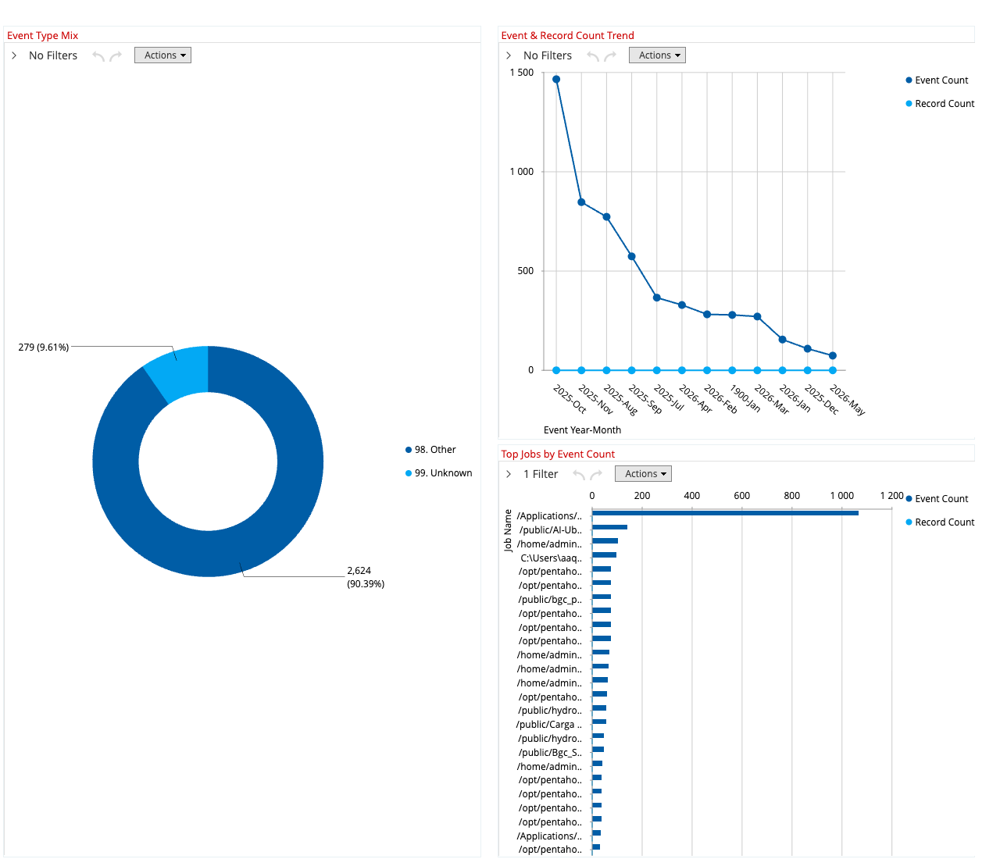
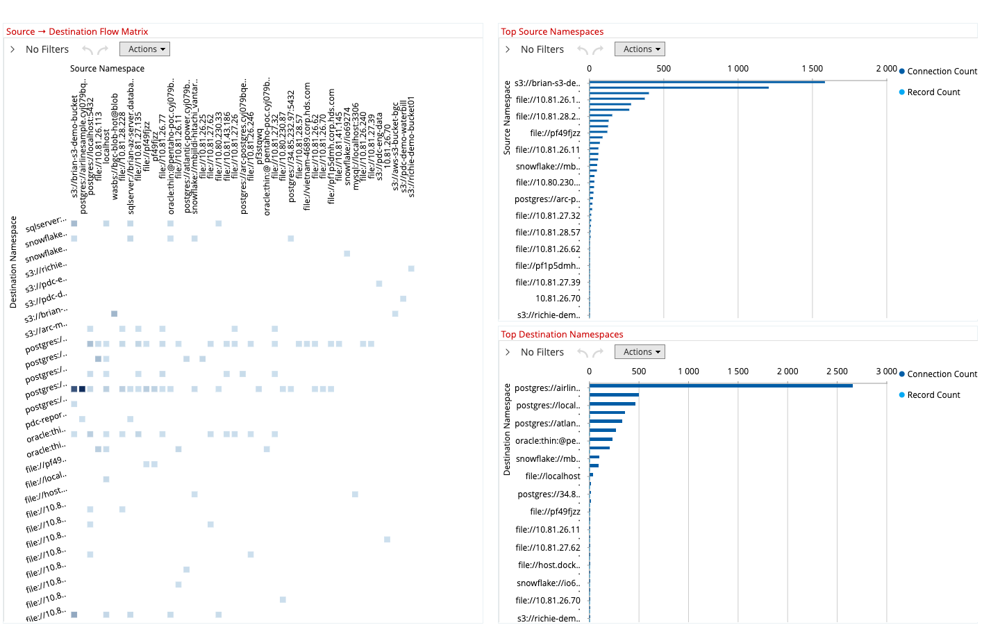
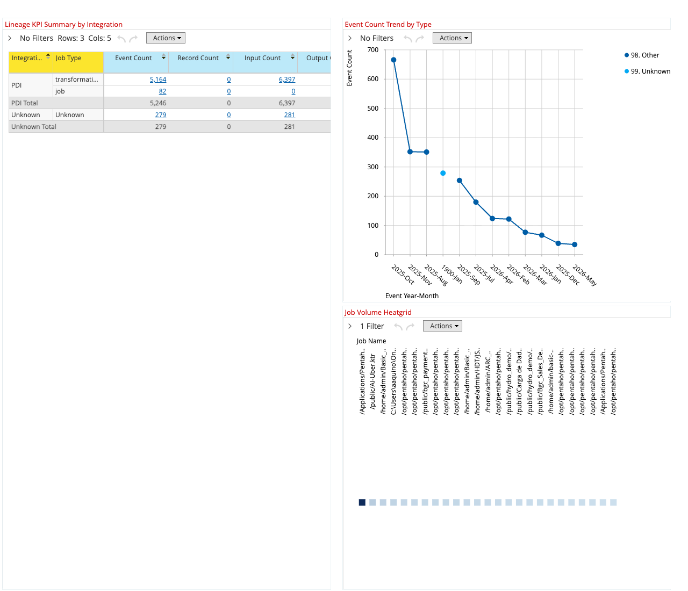

# Pentaho Data Catalog Analytics

**Manage your data estate with key performance dashboards.**

Pentaho Data Catalog (PDC) supports assessment and optimization of your data estate across multiple dimensions. This project turns PDC metadata into a star‑schema warehouse, a Mondrian cube, and a curated set of Analyzer reports and dashboards so business users — not just engineers — can answer the questions that matter.


## Analytics Categories

The platform is organized around twelve analytical perspectives. Each dashboard or report below maps to one or more of these categories.

| Category | What it answers | Coverage |
|---|---|---|
| **Storage Capacity** | Where is my data, how much, and where is it growing? | ✅ D10 Storage Footprint, D11 Storage Overview, D12 Structured / D13 Unstructured, D14 Top Heavies, `10-storage-by-data-source` |
| **Data Sensitivity** | Where is my regulated/sensitive data and is it protected? | ✅ D20 Data Sensitivity, D21 Sensitivity Analysis, `00-sensitivity-*` |
| **Policy Adherence** | Is the catalog actually being governed? Coverage by source? | ✅ D30 Policy Coverage, D31 Governance Health, `12-policy-*`, `10-governance-coverage`, `11-governance-mix-*` |
| **Data Source Usage** | Which sources contribute the most data and the most risk? | ✅ Cross‑cut on every dashboard, D40 Extension Trends, `00-resource-type-data-source-*` |
| **Data Quality** | How complete is the metadata? What's missing? | ✅ D31 Governance Health, `10-metadata-completeness`, `11-missing-attributes-by-source` |
| **PDC Administration** | Tag assessment, refresh status, repository health | ✅ D60 Pipeline Operations, `16-pipeline-*`, job consoles + variable manager (see *How to Configure*) |
| **PDC Application Usage** | How is PDC being used by people? | ✅ D70 Application Reach, `14-app-*` |
| **Data Temperature** *(Obsolescence)* | Which data is hot, warm, cold, frozen — and stale? | ✅ D80 Data Temperature, D84 Temperature Trends, `10-lifecycle-by-accessed-age`, `00-temperature-*`, `18-temperature-*` |
| **Redundant Data** | Where is duplicate / near‑duplicate content? | ✅ D90 Redundant Data Savings, `15-duplicate-*` (cube `75. Duplicate Savings`) |
| **Data Lineage** | What jobs move data where? Which sources feed which destinations? How often, what volumes? | ✅ D81 Lineage Activity, D82 Data Flow Map, D83 Lineage Operations Summary — cubes `79. Lineage Events` + `80. Data Lineage Connections` |
| **Lineage / Term Reach** | Which entities carry which terms? Term‑to‑entity reach? | ✅ Entity↔Term cube (`72. Entity Term`) + 6‑level glossary hierarchy |
| **Workflow / Collaboration** | Who owns what, who's accountable, who's the risk? | ✅ D95 Ownership Accountability, `10-owner-accountability`, `11-owner-risk-scatter` |
| **Cost Optimization / Planning** | What can be tiered or deleted? Sustainability impact? | ✅ D98 Cost Optimization, D10 Storage & Sustainability, `12-policy-cost-*`, `15-duplicate-savings-*`, `11-co2e-by-data-source`, `10-lifecycle-by-accessed-age` |

---

# Part 1 — How to Use

> **Audience:** business analysts, data stewards, executives. **Prerequisite:** the platform has been deployed (see *Part 2*).

## 1.1 Where to find everything

Open Pentaho User Console: **`http://<server>/pentaho/Home`** → **Browse Files** → **`/public/pdc-analysis/`**.

```
/public/pdc-analysis/
├── dashboards/      ← start here (executive views)
├── analyzer/        ← drill‑down reports (used as panels by dashboards)
└── utility/         ← admin tools (job console, variable manager)
```

## 1.2 Executive Dashboards

Double‑click any `.xdash` file to open it. Each dashboard is a single page of related panels.

The dashboard catalog is organized by the twelve analytics categories from the framework above. The tens digit of every dashboard ID maps to a category:

| Tens | Category |
|---|---|
| **D0x** | Executive roll‑up & cross‑cut |
| **D1x** | Storage Capacity |
| **D2x** | Data Sensitivity |
| **D3x** | Policy Adherence + Data Quality |
| **D4x** | Data Source Usage |
| **D6x** | PDC Administration |
| **D7x** | PDC Application Usage |
| **D8x** | Data Temperature (Obsolescence) + Data Lineage |
| **D9x** | Redundant Data, Workflow / Collaboration, Cost Optimization, Cross‑cut |

### Executive Roll‑up

#### D00 — Executive Value Command Center
Single board with KPIs + storage by source + lifecycle + governance % + completeness % + top 10 owners. **Open this first.**


#### D01 — Data Health Heatmap
Spot governance and quality gaps across the estate at a glance.


#### D99 — PDC Operations Overview
Cross‑cut snapshot: pipeline status, policy mix, app mix, redundancy, temperature.


### Storage Capacity (D1x)

#### D10 — Storage Footprint & Sustainability
Combine TB by source + lifecycle (accessed‑age) + CO₂e to make a tiering / archival case.


#### D11 — Storage Overview
One‑glance picture of total storage and where it concentrates (sunburst).


#### D12 — Structured Data Footprint
Profile relational/structured assets — counts, scatter, top‑10.


#### D13 — Unstructured Data Footprint
Profile files/objects — size patterns, top‑10 largest.


#### D14 — Top Heavies & Hotspots
Identify the largest paths and objects to target for remediation first.


### Data Sensitivity (D2x)

#### D20 — Data Sensitivity
Locate regulated data across sources.


#### D21 — Sensitivity Analysis
Drill into high‑risk sensitivity concentrations.


### Policy Adherence & Data Quality (D3x)

#### D30 — Policy Coverage
Policy coverage breadth, top policies, coverage by source/owner, governed cost. Each chart shows a single metric.


#### D31 — Governance Health
Coverage %, governed vs ungoverned counts, donut of governance status, missing attributes.


### Data Source Usage (D4x)

#### D40 — Extension Trends
File extension distribution and trend by category, source, and time.


### PDC Administration (D6x)

#### D60 — Pipeline Operations
ETL pipeline run health: success rates, runtimes, status mix and trend.


### PDC Application Usage (D7x)

#### D70 — Application Reach
Application access reach by app, source, owner; type mix.


### Data Temperature — Obsolescence (D8x)

#### D80 — Data Temperature
Hot / warm / cold / frozen distribution by glossary level and file type.


#### D84 — Temperature Trends
Temperature mix and trend over time, by source.


### Data Lineage (D8x)

#### D81 — Lineage Activity
Event type mix (Read / Write / Other) and event & record count trend over time; top 25 jobs by event volume. Answers: *what types of lineage activity are happening and when?*



#### D82 — Data Flow Map
Source → Destination connection matrix (scatter), top source namespaces and top destination namespaces by connection and record count. Answers: *what is flowing where?*



#### D83 — Lineage Operations Summary
KPI pivot by integration + job type (event count, record count, input / output counts), event count trend by type, and top-25 job volume heatgrid. Answers: *which jobs are the heaviest movers and what is the overall operational picture?*



### Redundant Data (D9x)

#### D90 — Redundant Data Savings
Storage redundancy savings — bytes, cost, category, resource‑type breakdowns.


### Workflow / Collaboration (D9x)

#### D95 — Ownership Accountability
Find top owners by storage, plot owner‑risk (completeness × storage × ungoverned count).


### Cost Optimization / Planning (D9x)

#### D98 — Cost Optimization
Cost rollups across policy, app, savings, temperature — single‑metric charts.


## 1.3 Reading the panels — design rules

The dashboard panels follow a few deliberate rules. Knowing them helps you trust what you see.

1. **One metric per chart, one grain per axis.** Bars and donuts only ever show measures of the same kind (TB next to TB, % next to %, counts next to counts). Mixing grains in a single bar would be visually deceiving.
2. **Tables are for mixed metrics.** The KPI table (`10-exec-kpis`) is a native pivot — that's the only place TB, %, and counts coexist, and the table format makes the units obvious.
3. **Scatter / bubble for cross‑grain relationships.** When you see a bubble chart (e.g. **Owner Risk**), each axis intentionally encodes a *different* unit — that's what scatter is for.
4. **Stacked bars only stack same‑grain things.** "Governance Mix" stacks governed + ungoverned counts. "Missing Attributes" stacks three count metrics at the same grain.
5. **Naming convention.** Every panel title states the metric and the grain — e.g. *"Storage TB by Data Source"* — so you never have to guess.
6. **Asset Mix is unfiltered.** The Asset Mix donut on D10 reflects the full estate (no date filter) so the structured/unstructured split represents *total* composition, not a single scan window.

## 1.4 Drill, slice, and pivot

Every panel is a live Analyzer report — right‑click any cell to drill, change the chart, swap dimensions, or export to Excel/CSV. Standard slicers available across the catalog:

- **Time** — Scanned, Created, Modified, Accessed, Last Update, Last Update Statistics (6 role‑playing date dimensions). Filter by year/month or by *age in months/years* (e.g. "Accessed > 24 months").
- **Source** — Data Source Type (AWS, AZURE, MSSQL, POSTGRES, SNOWFLAKE, …) and Data Source Name.
- **Entity** — Type, Path, FQDN, Owner, Group.
- **Glossary** — 6‑level business glossary; sensitivity / temperature classifications.
- **Resource Type** — Database, Schema, Table, Column, File, etc.

## 1.5 Daily / weekly workflow

| Cadence | Open this | Look for |
|---|---|---|
| **Daily steward** | D31 Governance Health, D95 Ownership Accountability | New ungoverned entities, missing‑owner spikes |
| **Weekly architect** | D10 Storage & Sustainability, D14 Top Heavies, D90 Redundant Data | Growth deltas, archival candidates, savings opportunities |
| **Weekly ops** | D60 Pipeline Operations, D83 Lineage Operations Summary | Failed runs, runtime drift; job volume trends |
| **Weekly lineage** | D81 Lineage Activity, D82 Data Flow Map | New sources or destinations, unexpected data flows |
| **Monthly exec** | D00 Executive Value Command Center, D99 PDC Operations Overview | Trend in coverage %, completeness %, total TB & CO₂e, cross‑cut health |

---

# Part 2 — How to Configure

> **Audience:** Pentaho administrators and BI engineers deploying or upgrading the platform.

## 2.1 Prerequisites

- **PostgreSQL 17.7+** with the `bidb_ext_demo` schema (PDC's metadata target).
- **Pentaho Server 11.x** running, reachable at `http://<server>:80/pentaho`.
- **Pentaho Data Catalog** populated, with `entities_master_view` and `terms_view` available (FDW or direct).
- A workstation with `bash`, `curl`, `psql` to run the deploy scripts in `utility/`.

## 2.2 One‑time setup

### Step 1 — Build the warehouse

Two options, both produce the same 27 materialized views (plus the 2 lineage staging tables, which are created with `CREATE TABLE IF NOT EXISTS` and populated separately by the lineage ETL).

**A. Pentaho‑driven (preferred, repeatable):**

Run the orchestrator job `j-main-script.kjb` from the User Console. It calls `j-set-system-var` (loads connection strings + credentials from `utility/properties/pdc_analysis.properties`) and then `t-execute-repo-file.ktr` (iterates the SQL files in `ddl/`, performs `${VAR}` substitution, splits multi‑statement SQL on semicolons with dollar‑quote awareness, and executes against PostgreSQL).

Or trigger via REST:
```bash
curl -u admin:password "http://<server>/pentaho/kettle/runJob/?job=/public/pdc-analysis/utility/main/j-main-script"
```

**B. Direct psql (standalone):**
```bash
psql -h <host> -U postgres -d bidb_ext_demo -f content/public/pdc-analysis/ddl/00-execute-all.sql
```

### Step 2 — Publish the Mondrian cube

```bash
cd utility
./push-cube.sh ../analyzer/bidb_ext.xml PDC-BIDB-EXT 10.80.230.193:80 admin password
```

This uploads the schema, binds it to the `PDC-BIDB-EXT` JDBC datasource, enables XMLA, and refreshes the Mondrian cache. Cubes appear in Analyzer immediately.

### Step 3 — Publish dashboards, reports, and utility content

```bash
./utility/push-content.sh --smart-title \
  ./content/public/pdc-analysis /public/pdc-analysis 10.80.230.193:80 admin password
```

Smart sync — diffs local against the server, only uploads new/changed files, backs up server versions to `archive/content-backup/<timestamp>/` before overwriting. Add `--dry-run` first to preview.

## 2.3 Day‑two operations

### Refresh the warehouse on a schedule

Use `j-refresh-only.kjb` (skips DDL rebuild, just refreshes the materialized views) on a cron / Pentaho scheduler.

### Edit runtime variables without touching files

Open `http://<server>/pentaho/api/repos/:public:pdc-analysis:utility:sample-variable-manager.html/generatedContent` to get/set Kettle variables (DB hosts, credentials, schema names) through a browser UI.

### Run jobs from a browser

Open `http://<server>/pentaho/api/repos/:public:pdc-analysis:utility:sample-job-console.html/generatedContent` to launch any job with real‑time status polling.

### Push content from local edits

```bash
# Preview
./utility/push-content.sh --dry-run --smart-title ./content/public/pdc-analysis /public/pdc-analysis 10.80.230.193:80
# Push
./utility/push-content.sh --smart-title ./content/public/pdc-analysis /public/pdc-analysis 10.80.230.193:80 admin password
```

### Pull server content into git

```bash
./utility/pull-content.sh ./content/public/pdc-analysis /public/pdc-analysis 10.80.230.193:80 admin password
```

### Bidirectional sync (resolve by timestamp, prefer‑local, or prefer‑server)

```bash
./utility/sync-content.sh --smart-title ./content/public/pdc-analysis /public/pdc-analysis 10.80.230.193:80 admin password
./utility/sync-content.sh --prefer-local  ./content/public/pdc-analysis /public/pdc-analysis 10.80.230.193:80 admin password
./utility/sync-content.sh --prefer-server ./content/public/pdc-analysis /public/pdc-analysis 10.80.230.193:80 admin password
```

### Migrate to a new server

```bash
./utility/migrate-server.sh 10.80.230.123:80 10.80.230.225:80 admin password
```

Migrates `/public` content, `/home` user files, and datasource definitions (Analysis, DSW, Metadata, JDBC). Does **not** migrate server settings, LDAP/SSO, schedules, user accounts, JNDI, or installed plugins — those are platform‑level concerns.

## 2.4 Adding a new report or dashboard

1. Build it in Analyzer (use a single metric per chart unless you genuinely need cross‑grain comparison — then use scatter/bubble).
2. Save under `/public/pdc-analysis/analyzer/` or `/public/pdc-analysis/dashboards/`.
3. Pull into git: `./utility/pull-content.sh ./content/public/pdc-analysis /public/pdc-analysis <server>`.
4. Commit and push.

## 2.5 Adding a new SQL DDL step

1. Drop a new `.sql` file under `ddl/0X-*/` and reference it in `00-execute-all.sql` (psql `\ir`).
2. Add it to the data grid inside `t-execute-repo-file.ktr` so the harness picks it up.
3. Re‑run `j-main-script`.

---

# Part 3 — Technical Reference

> **Audience:** engineers extending the schema, the harness, or the deploy tooling.

## 3.1 Project layout

```
pdc-analysis/
├── analyzer/
│   ├── bidb_ext.xml                    # Production Mondrian schema (10 physical cubes + 1 virtual cube)
│   ├── deprecated/                     # Archived schema versions
│   └── archive/                        # Legacy cube definitions
├── content/
│   └── public/pdc-analysis/
│       ├── analyzer/                   # 30+ pre-built Analyzer reports (.xanalyzer + .locale)
│       ├── dashboards/                 # 14 dashboards (.xdash + .locale)
│       ├── ddl/                        # SQL scripts (deployed to Pentaho repository)
│       │   ├── 00-execute-all.sql      # Master DDL script (psql \ir orchestration)
│       │   ├── 01-setup/               # FDW, utilities, cleanup; lineage physical tables
│       │   ├── 02-staging/             # Staging materialized views
│       │   ├── 03-dimensions/          # 16 dimension MVs (incl. 3 lineage dims)
│       │   ├── 04-facts/               # 10 fact MVs (incl. 2 lineage facts)
│       │   ├── 05-refresh/             # Materialized view refresh
│       │   └── README.md               # Detailed DDL documentation
│       └── utility/
│           ├── sample-job-console.html          # Web UI for running jobs
│           ├── sample-variable-manager.html     # Web UI for managing runtime variables
│           ├── properties/pdc_analysis.properties  # Runtime config (connection strings, creds)
│           ├── main/
│           │   ├── j-main-script.kjb            # Main orchestration job
│           │   ├── j-set-system-var.kjb         # Loads variables from properties file
│           │   ├── j-refresh-only.kjb           # Refresh-only job (skip DDL rebuild)
│           │   ├── t-execute-repo-file.ktr      # Dynamic SQL executor
│           │   └── t-set-variables-from-properties.ktr
│           └── lineage/
│               ├── j-lineage-main.kjb           # Lineage ETL orchestrator (truncate + load + refresh)
│               ├── page-iterator.kjb            # Paginator: loops t_PDC_get_lineage until !hasNextPage
│               ├── t_PDC_authenticate.ktr       # Keycloak OAuth2 token fetch
│               ├── t_PDC_get_lineage.ktr        # Single-page lineage API fetch
│               └── t-load-lineage-stg.ktr       # JSON parse + stg table loader
├── archive/content-backup/             # Timestamped backups from sync scripts (gitignored)
├── utility/
│   ├── migrate-server.sh, download.sh, upload.sh
│   ├── sync-content.sh, push-content.sh, pull-content.sh
│   ├── push-cube.sh
│   ├── push-datasources.sh, pull-datasources.sh
│   └── pull-home-files.sh, push-home-files.sh
└── README.md
```

## 3.2 Data Architecture

### 3.2.1 End‑to‑End Data Flow

```
  ┌────────────────────────┐       postgres_fdw         ┌──────────────────────────┐
  │  PDC operational DB    │ ─────────────────────────▶ │  bidb_ext_dev (analytics)│
  │  (schema: bidb_ext)    │   foreign server           │  PostgreSQL 17.7         │
  │                        │   `remote_bidb`            │                          │
  │  • catalog views       │                            │  • staging MV            │
  │  • policy / app views  │                            │  • 16 dimension MVs      │
  │  • trend / ops views   │                            │  • 10 fact MVs           │
  └────────────────────────┘                            └────────────┬─────────────┘
                                                                      │ Mondrian
  ┌────────────────────────┐       REST API             │             ▼
  │  PDC Lineage API       │ ─────────────────────────▶ │  bidb_ext.xml            │
  │  (OpenLineage format)  │   j-lineage-main.kjb       │  10 physical cubes +     │
  │  Keycloak OAuth2 auth  │   → stg_lineage_event      │  1 virtual cube          │
  │  GET /lineage/api/     │   → stg_lineage_connection └────────────┬─────────────┘
  │    events?perPage=100  │                                          ▼
  └────────────────────────┘                             Analyzer reports + dashboards
```

The analytics database is a **separate PostgreSQL schema (`bidb_ext_dev`)** that materializes a star‑schema warehouse from the live PDC catalog. Source tables/views live in the operational PDC database and are exposed through a **PostgreSQL foreign data wrapper** (`remote_bidb` server, set up by `01-setup/01-fdw-setup.sql`). Every analytics object is a **`MATERIALIZED VIEW`** so reports run against pre‑computed snapshots, not live OLTP queries. Refresh is orchestrated by `05-refresh/01-refresh-all.sql` and triggered from the Pentaho job `j-main-script.kjb` (or `j-refresh-only.kjb` to skip the rebuild).

**Lineage data** flows through a separate path: `j-lineage-main.kjb` authenticates against Keycloak, paginates the OpenLineage events REST API, parses JSON, explodes input×output pairs into connection rows, and truncate‑reloads `stg_lineage_event` and `stg_lineage_connection` — **physical tables** (not MVs) that survive schema rebuilds. The job then refreshes the three lineage dimension MVs and two lineage fact MVs.

### 3.2.2 Analytics Schema (`bidb_ext_dev`) — 27 Materialized Views + 2 Physical Tables

**Staging (1 MV + 2 physical tables)**

| Object | Kind | Source(s) | Notes |
|---|---|---|---|
| `mv_stg_entity_term` | MV | `entities_master_view` ⟕ `terms_view` ⟕ `glossary_summary_view` | Unified entity+term staging; resolves glossary path; foundation for most dims and facts. |
| `stg_lineage_event` | TABLE | PDC Lineage REST API (via ETL) | One row per lineage event; persists across schema rebuilds. Loaded by `j-lineage-main.kjb`. |
| `stg_lineage_connection` | TABLE | PDC Lineage REST API (via ETL) | One row per input×output pair per event (cartesian product). |

**Dimensions (16)**

| MV | Source(s) | Description |
|---|---|---|
| `dim_date` | derived from MIN/MAX timestamps in `mv_stg_entity_term` | Continuous date range + Unknown row (`1900‑01‑01`, key `19000101`) for missing timestamps. |
| `dim_term` | `mv_stg_entity_term` | Classification terms (Hot/Cold/PII/…); includes "No Term Available" default member. |
| `dim_glossary_term` | `glossary_summary_view` | 6‑level ragged business‑glossary hierarchy parsed from FQDN; includes "No Glossary Available" default. |
| `dim_entity` | `mv_stg_entity_term` ⟕ `entities_master_view` ⟕ `datasource_category_mapping` ⟕ `currency_exchange_rates` ⟕ `entities_custom_categorization` (+ lateral fallbacks on `entities_master_view`) | Entity master with structural attrs, cost/currency in USD with 2‑level fallback, profile/quality, key flags, document metadata, custom & data‑source category. |
| `dim_datasource` | `mv_stg_entity_term` | Data source type, name, id (conformed). |
| `dim_filetype` | `mv_stg_entity_term` | File type taxonomy + "No File Type Available" default. |
| `dim_leaf_flag` | static (2 rows) | true/false toggle for leaf‑term filtering. |
| `dim_policy` | `policies_summary_view` ⟕ `mv_policies_summary` | One row per policy with 3‑level glossary hierarchy when present. |
| `dim_application` | `applications_summary_view` | Discovered applications; counts cardinality of `UsersWithAccess` jsonb. |
| `dim_extension` | `entities_extension_count_view` | Distinct file extensions for trend cube grain. |
| `dim_temperature` | `entities_temperature_count_view` ∪ static canonical list | Stable temperature membership (Hot/Warm/Cold/Frozen) even on sparse days. |
| `dim_currency` | `currency_exchange_rates` | Currency lookup with USD conversion rate. |
| `dim_pipeline_status` | `pipeline_log` ∪ static canonical list | Pipeline run status with sort/order keys. |
| `dim_lineage_event_type` | `stg_lineage_event` ∪ static canonical list | Event type lookup (Write/Read/Delete/Unknown); includes sort and boolean flags. |
| `dim_lineage_job` | `stg_lineage_event` | Integration × job_type × job_name × processing_type hierarchy. |
| `dim_lineage_endpoint` | `stg_lineage_connection` | Unique data endpoints (sources ∪ destinations); includes `entity_key` (MD5 of name) matching `dim_entity.entity_key` for cross-cube joins. |

**Facts (10)**

| MV | Grain | Source(s) | Key measures |
|---|---|---|---|
| `fact_entity_snapshot` | entity × scanned_date | `mv_stg_entity_term` ⟕ `entities_master_view` | Storage size, child counts, freshness/lifecycle bands, governance & metadata‑quality flags. Six date FKs (Scanned, Created, Modified, Accessed, Last Update, Last Update Statistics). |
| `fact_entity_term` | entity × term | `mv_stg_entity_term` ⟕ `dim_glossary_term` ⟕ latest `fact_entity_snapshot` | Many‑to‑many entity↔term association; carries most‑recent storage for "GB by Term" analysis; links to `glossary_term_key` for hierarchy rollups. |
| `fact_entity_policy` | entity × policy | `entities_policies_view` ⟕ `dim_entity` ⟕ `entities_master_view` | `assignment_count`, `governed_size_tb`, `governed_cost_usd`. |
| `fact_entity_application` | entity × application | `entities_applications_view` ⟕ `dim_entity` ⟕ `entities_master_view` | `access_count`, `accessed_size_tb`, `accessed_cost_usd`. |
| `fact_duplicate` | duplicate group | `mv_duplicate_savings_by_original_view` ⟕ `duplicate_files_view` (example) ⟕ `dim_entity` | `duplicate_group_count`, `duplicate_file_count`, `savings_size_tb`, `savings_cost_usd`. |
| `fact_pipeline_run` | job_id × view_name × started_at | `pipeline_log` | `run_count`, `success_count`, `failure_count`, `runtime_seconds`; FKs to `dim_pipeline_status`, `dim_date` (started/completed). |
| `fact_extension_daily` | data source × extension × date | `entities_extension_count_view` | `file_count`. Conformed FKs to `dim_datasource`, `dim_extension`, `dim_date`. |
| `fact_temperature_daily` | data source × temperature × date | `entities_temperature_count_view` | `file_count`. Conformed FKs to `dim_datasource`, `dim_temperature`, `dim_date`. |
| `fact_lineage_event` | lineage event | `stg_lineage_event` | `event_count`, `input_count`, `output_count`, `record_count`. FKs to `dim_lineage_event_type`, `dim_lineage_job`, `dim_date`. |
| `fact_lineage_connection` | source × destination × event | `stg_lineage_connection` ⟕ `stg_lineage_event` | `connection_count`, `record_count`. Role-playing endpoint FKs (`source_endpoint_key`, `dest_endpoint_key` both → `dim_lineage_endpoint`). Also carries `source_entity_key`/`dest_entity_key` (MD5 of name) for optional join to `dim_entity`. |

### 3.2.3 Physical Star Schema Reference

```
-- Staging (MV)
mv_stg_entity_term          - Staging (entities + terms + glossary context)

-- Lineage staging (physical tables — survive schema rebuilds)
stg_lineage_event           - One row per PDC lineage API event
stg_lineage_connection      - One row per input×output pair per event

-- Dimensions (MVs)
dim_date                    - Date dimension with Unknown row
dim_entity                  - Entity attributes, hierarchy, profile stats, cost, categories
dim_term                    - Classification terms
dim_glossary_term           - 6-level business glossary hierarchy
dim_datasource              - Source systems
dim_filetype                - File type taxonomy
dim_leaf_flag               - Leaf-term filter (true/false)
dim_policy                  - Policy master + policy glossary hierarchy
dim_application             - Discovered applications and user reach
dim_extension               - File-extension lookup
dim_temperature             - Hot/Warm/Cold/Frozen temperature lookup
dim_currency                - Currency + USD conversion rates
dim_pipeline_status         - Pipeline status lookup
dim_lineage_event_type      - Lineage event type (Write/Read/Delete) + sort/flag cols
dim_lineage_job             - Lineage job identity (integration × job_type × job_name)
dim_lineage_endpoint        - Unique data endpoints (sources ∪ destinations)

-- Facts (MVs)
fact_entity_snapshot        - Entity daily snapshots
fact_entity_term            - Entity-term associations
fact_entity_policy          - Entity-policy assignments
fact_entity_application     - Entity-application access
fact_duplicate              - Duplicate-group savings
fact_pipeline_run           - Pipeline execution history
fact_extension_daily        - Daily file counts by data source + extension
fact_temperature_daily      - Daily file counts by data source + temperature
fact_lineage_event          - One row per lineage event (event count, record count)
fact_lineage_connection     - One row per source→destination edge per event
```

**Date Foreign Keys**
```sql
-- Entity Snapshot: 6 role-playing date dimensions
scanned_date_key, created_date_key, modified_date_key,
accessed_date_key, last_update_date_key, last_update_statistics_date_key

-- Entity Term: 4 role-playing date dimensions
created_date_key, modified_date_key, accessed_date_key, scanned_date_key

-- Pipeline Run: 2 role-playing date dimensions
started_date_key, completed_date_key

-- Extension / Temperature trends: 1 snapshot date dimension
snapshot_date_key

-- Lineage facts: 1 event date dimension each
event_date_key   -- fact_lineage_event and fact_lineage_connection
```
All use `COALESCE(to_char(ts::date, 'YYYYMMDD')::int, 19000101)`.

### 3.2.4 Source Tables & Views (PDC operational DB, accessed via FDW)

| Source object | Kind | What it provides |
|---|---|---|
| `entities_master_view` | catalog view | One row per catalog entity: identity, type, path, FQDN, owner, group, size, child counts, all 6 timestamps, cost‑per‑TB, currency, profile/quality stats (RowCount, NullCount, Cardinality, Hll), key flags (PK/FK/Nullable), document metadata (Title, Author, Application, Company, PageCount). |
| `terms_view` | catalog view | Classification term assignments per entity (FQDN‑joined). |
| `glossary_summary_view` | catalog view | Glossary node hierarchy used to derive 6‑level ragged hierarchy. |
| `datasource_category_mapping` | reference | Maps `DataSourceType` → category for `dim_entity` rollups. |
| `entities_custom_categorization` | reference | Customer‑defined categorization joined into `dim_entity`. |
| `currency_exchange_rates` | reference | USD conversion factors used by cost measures and `dim_currency`. |
| `policies_summary_view` | governance | Master list of policies (one per policy). |
| `mv_policies_summary` | governance | Pre‑built MV with policy → glossary level hierarchy. |
| `entities_policies_view` | governance | Entity ⨯ policy assignments (drives `fact_entity_policy`). |
| `applications_summary_view` | usage | One row per discovered application (with `UsersWithAccess` jsonb array). |
| `entities_applications_view` | usage | Entity ⨯ application access (drives `fact_entity_application`). |
| `duplicate_files_view` | dedup | Raw duplicate file records used to attach an example entity to each group. |
| `mv_duplicate_savings_by_original_view` | dedup | Pre‑aggregated duplicate‑group savings (size + cost). |
| `entities_extension_count_view` | trends | Daily file counts by data source × extension. |
| `entities_temperature_count_view` | trends | Daily file counts by data source × temperature band. |
| `pipeline_log` | ops | One row per pipeline job_id × view × started_at (status, timestamps). |

### 3.2.5 Conformed Date Dimension & Time‑Based Analysis

- 6 role‑playing date dimensions on `fact_entity_snapshot`: **Scanned, Created, Modified, Accessed, Last Update, Last Update Statistics**.
- Age calculations (months/years) precomputed for staleness/temperature analysis.
- Every fact's date FK uses `COALESCE(to_char(ts::date,'YYYYMMDD')::int, 19000101)` so the Unknown row always satisfies drill‑through.
- `dim_date` covers `MIN(date) → MAX(date)` across all source timestamps + current date, regenerated every refresh.

### 3.2.6 Mondrian Semantic Model (`analyzer/bidb_ext.xml`)

The current Mondrian schema is **not a three‑cube design**. It contains **10 physical cubes** plus **1 virtual cube**:

| Cube | Backing fact MV | Purpose |
|---|---|---|
| `71. Entity Snapshot` | `fact_entity_snapshot` | Core entity-grain inventory, storage, lifecycle, metadata quality, governance coverage, and environmental measures. |
| `72. Entity Term` | `fact_entity_term` | Many-to-many entity↔term analysis with glossary rollups and term-attributed storage. |
| `73. Entity Policy` | `fact_entity_policy` | Policy adherence / governed-capacity analysis. |
| `74. Entity Application` | `fact_entity_application` | Application reach and app-attributed storage/cost analysis. |
| `75. Duplicate Savings` | `fact_duplicate` | Redundant data savings by duplicate group. |
| `76. Pipeline Run` | `fact_pipeline_run` | PDC analytics pipeline operations, runtime, and success/failure tracking. |
| `77. Extension Trend` | `fact_extension_daily` | Daily file-extension trends by data source. |
| `78. Temperature Trend` | `fact_temperature_daily` | Daily hot/warm/cold/frozen temperature trends by data source. |
| `79. Lineage Events` | `fact_lineage_event` | Event-level lineage activity: event counts, input/output counts, record counts by type/job/date. |
| `80. Data Lineage Connections` | `fact_lineage_connection` | Source→destination data flow edges with role-playing Source Endpoint and Destination Endpoint dimensions. |
| `01. Data Asset Analysis` | virtual over `71. Entity Snapshot` + `72. Entity Term` | Business-facing blended cube for core asset + term analysis using conformed dimensions. |

Conformed dimensions (`dim_date`, `dim_entity`, `dim_datasource`, `dim_glossary_term`, etc.) keep Analyzer reports consistent across cubes. The dedicated physical cubes keep each report at a single fact grain, while the virtual cube exposes the primary asset/term measures together for the executive and cross-cut dashboards.

> **Mondrian schema ordering constraint**: All regular `<Cube>` elements **must** appear before any `<VirtualCube>` in the XML. Mondrian silently ignores any `<Cube>` defined after a `<VirtualCube>` — the cube loads without error but never appears in Analyzer's data source selector. In `bidb_ext.xml`, cubes 71–80 appear at lines ~506–1641 and the virtual cube follows at lines ~1648–end.

### 3.2.7 Refresh Strategy

- **27 MV objects** are refreshed in dependency order by `05-refresh/01-refresh-all.sql`:
  1. staging (`mv_stg_entity_term`)
  2. dimensions (date first, then attribute dims, then lineage dims)
  3. facts (snapshot first, then term/policy/application/duplicate/pipeline/extension/temperature, then lineage facts)
- **2 physical tables** (`stg_lineage_event`, `stg_lineage_connection`) are populated by `j-lineage-main.kjb` (truncate + reload from PDC API); they are **not** dropped by `03-drop-all-objects.sql` and are not touched by `j-refresh-only.kjb`.
- DDL is idempotent: `01-setup/03-drop-all-objects.sql` cleans all MVs before rebuild; `j-refresh-only.kjb` skips the rebuild and just re‑refreshes data.
- Indexes are created on every date FK and natural‑key column to keep Mondrian SQL within MOLAP‑like response times.

### 3.2.8 Mondrian Categorization (cube editor)

```
01-06: Business dimensions (Data Source, Entity attributes, Terms, Policy, Application)
05:    Time Attributes (date hierarchies)
05:    Time Attributes — Year/Month Age (separate category for age metrics)
11-15: Measures (Object Volume, Storage Size, Children, Total Children, Environmental Impact, Cost USD)
70-79: Core/technical cubes (Entity Snapshot, Entity Term, Pipeline Run, Duplicate Savings, Extension/Temperature trends)
```

## 3.3 Pentaho Processing Harness

```
j-main-script.kjb
  ├── j-set-system-var.kjb           # Loads variables from pdc_analysis.properties
  │   └── t-set-variables-from-properties.ktr
  └── t-execute-repo-file.ktr        # Fetches SQL files from repo, splits, executes
```

`t-execute-repo-file.ktr` iterates a configurable data grid of SQL file paths, fetches each file via the BA Server `generic-files` API, performs `${VAR}` substitution, splits multi‑statement SQL on semicolons (dollar‑quote aware), and executes each statement against PostgreSQL. Adding/removing SQL is a data‑grid edit — no code changes.

**Outputs:**
- 27 materialized views (1 staging, 16 dimensions, 10 facts)
- 2 physical tables for lineage staging (populated by ETL, not by this harness)
- Date dimension covering MIN→MAX of all date fields + current
- Unknown date row (1900‑01‑01, key=19000101) for missing timestamps
- All fact date FKs use `COALESCE(to_char(ts::date, 'YYYYMMDD')::int, 19000101)`
- Default "No Glossary Available" member for missing glossary assignments
- Term fact links to `glossary_term_key` for hierarchy rollups
- Indexes on every date FK

## 3.4 Utility Scripts (reference)

### `migrate-server.sh` — full server‑to‑server migration
```bash
./migrate-server.sh [flags] <source-server> <target-server> [user] [pass]
```
Flags: `--dry-run`, `--skip-content`, `--skip-home`, `--skip-ds`, `--no-git`, `--content-path <path>`, `--smart-title`. Runs in three phases: pull from source → snapshot to git → push to target. /home content uses file‑by‑file `/inline` API to bypass legacy 403 restrictions; `.ktr`/`.kjb` zip wrappers are auto‑extracted before re‑upload.

### `push-cube.sh` — Mondrian schema publishing
```bash
./push-cube.sh <xml-file> <datasource> <server[:port]> [user] [pass]
```
Validates connectivity, uploads via Data Source Analysis REST API, enables XMLA, refreshes Mondrian cache. Exit 0 on success.

### `upload.sh` — repository file/folder upload
```bash
./upload.sh [--dry-run] [--smart-title] [--title "Name"] <source> <repo-path> <server[:port]> [user] [pass]
```
Single file or recursive directory. `--smart-title` auto‑titles from filenames (`j-main-script.kjb` → "J Main Script"). Sets both locale properties and metadata. Binary upload mode (`--data-binary`, not multipart) prevents boundary errors.

### `download.sh` — counterpart to upload.sh
```bash
./download.sh [--dry-run] <repo-path> <local-path> <server[:port]> [user] [pass]
```
Auto‑detects file vs folder; folders arrive as zip and are auto‑extracted.

### `push-content.sh` — smart sync UP
```bash
./push-content.sh [--dry-run] [--smart-title] <local-dir> <repo-path> <server[:port]> [user] [pass]
```
Pulls server state, diffs against local, uploads only new/changed files, backs up server versions to `archive/content-backup/<timestamp>/`. Ignores `.locale` timestamp comments to avoid false positives.

### `pull-content.sh` — smart sync DOWN
```bash
./pull-content.sh [--dry-run] <local-dir> <repo-path> <server[:port]> [user] [pass]
```
Downloads server content, skips identical files, backs up locally‑changed files before overwrite.

### `sync-content.sh` — bidirectional sync
```bash
./sync-content.sh [--dry-run] [--smart-title] [--prefer-local|--prefer-server] \
    <local-dir> <repo-path> <server[:port]> [user] [pass]
```
Single command instead of separate push+pull. Conflicts resolved by mtime (newer wins) unless `--prefer-local`/`--prefer-server` overrides. Losing versions archived. Compatible with macOS bash 3.2 and Linux.

### `pull-datasources.sh` / `push-datasources.sh`
Export and import Analysis, DSW, Metadata, and JDBC definitions. Organized directory layout (`analysis/`, `dsw/`, `metadata/`, `jdbc/`). `--uncompress` extracts ZIP exports.

### `pull-home-files.sh` / `push-home-files.sh`
File‑by‑file `/home` directory transfer to bypass the 403 restriction on `/home` zip exports in older Pentaho versions. Falls back from `/inline` to `/download` on failure. Auto‑extracts `.ktr`/`.kjb` export bundles before re‑upload (avoids HTTP 500 on Pentaho 11).

## 3.5 Design notes

**Date dimension** — complete range (MIN→MAX of all date fields + current) with Unknown=1900‑01‑01; 6 role‑playing usages off a single physical table; **no** `TimeDimension` type (so Analyzer categorizes properly via annotations); drill‑through never INNER‑JOIN‑fails on NULL.

**Environmental impact** — CO₂e at `(Size Bytes / 1099511627776) * 0.35` (industry standard 0.35 metric tons / TB‑year). Aggregates correctly across any dimension combo.

**Glossary level ordering** — `dim_glossary_term.level_2_sort` enforces business order (Frozen=1, Cold=2, Warm=3, Hot=4, else 999) instead of alphabetical.

**Single‑grain chart rule** — every `10-*` and `11-*` Analyzer report carries one metric (or same‑grain group). Mixed metrics live in pivot tables (`10-exec-kpis`) or in scatter/bubble (`11-owner-risk-scatter`) where each axis encodes a different unit on purpose.

**Lineage endpoint cross-cube key** — `dim_lineage_endpoint.entity_key` is `md5(lower(trim(endpoint_name)))`, identical to `dim_entity.entity_key`. This lets analysts correlate lineage connections with catalog entities without a bridge table, joining directly on the MD5 key.

**Lineage role-playing endpoints** — `fact_lineage_connection` contains two endpoint FKs (`source_endpoint_key`, `dest_endpoint_key`) that both reference `dim_lineage_endpoint`. In the Mondrian schema these are two separate inline `<Dimension>` blocks (not `<DimensionUsage>`) so they appear as distinct fields ("Source Endpoint", "Destination Endpoint") in Analyzer.

**Mondrian VirtualCube ordering** — Mondrian silently drops any `<Cube>` element that appears after a `<VirtualCube>` in the schema XML. All regular cubes must be declared first. See Troubleshooting for detection steps.

## 3.6 Troubleshooting

**Drill‑through returns 0 rows**
- Check date keys: `SELECT COUNT(accessed_date_key) FROM fact_entity_term;`
- If NULLs exist, rebuild views with the COALESCE→19000101 pattern
- Verify the 1900‑01‑01 row exists in `dim_date`

**Dates not grouping in Analyzer**
- Remove `type="TimeDimension"` from the Date dimension
- Add `<Annotation name="AnalyzerBusinessGroup">05. Time Attributes</Annotation>` to **all** levels (Year, Month, Date) **and** to the `DimensionUsage` elements

**Schema not appearing**
- Verify the datasource exists and is active
- `curl http://<server>:<port>/pentaho/api/system/refresh/mondrianSchemaCache`
- Check `catalina.out` for Mondrian errors

**File upload "unmarshall boundary" errors**
- Use `upload.sh` (binary `--data-binary`, not multipart form‑data)

**Titles missing in BA Server console**
- `upload.sh --smart-title` sets both locale properties and metadata
- `.kjb`/`.ktr` display names come from `/localeProperties`, not `/metadata`
- Verify: `curl -u admin:password http://<server>/pentaho/api/repo/files/<pathId>/localeProperties`

**Analyzer reports won't load after upload**
- Confirm `.locale` files were uploaded alongside `.xanalyzer` / `.xdash`
- Use `upload.sh` for recursive directory uploads

**Cube appears in XML but not in Analyzer's data source selector**
- Most likely cause: the `<Cube>` element is defined *after* a `<VirtualCube>` in the schema XML. Mondrian silently ignores regular cubes that follow a virtual cube — no error is logged.
- Detect it: query the XMLA endpoint. The SOAP `MDSCHEMA_CUBES` request against `DataSourceInfo=PDC` (the Schema name, not the JNDI pool name) returns only the cubes Mondrian actually loaded. Compare against your XML to find the missing ones.
- Fix: reorder the XML so all `<Cube>` elements precede the `<VirtualCube>`, then re-push with `push-cube.sh`.

## 3.7 Content Inventory

**Analyzer reports** (`content/public/pdc-analysis/analyzer/`)
- `00-*` — temperature, sensitivity, resource type, paths, scatter, sunburst, top‑10 (overall, structured, unstructured, by data source, by file type)
- `10-*` — single‑grain executive measures: storage TB by source, governance coverage %, lifecycle TB by accessed age, metadata completeness %, top‑10 owners, exec KPI pivot table
- `11-*` — governance & risk views: governance mix bar + donut, missing attributes by source, CO₂e by source, owner‑risk bubble scatter

**Dashboards** (`content/public/pdc-analysis/dashboards/`)
- `D00-*` — foundational views: storage overview, sensitivity, sensitivity analysis, structured / unstructured footprint, top heavies & hotspots, data temperature, data health heatmap
- `D01-*` / `D02-*` — temperature variations
- `D10` — Executive Value Command Center
- `D11` — Governance Health
- `D12` — Storage Footprint & Sustainability
- `D13` — Ownership Accountability

Every report and dashboard has a matching `.locale` file controlling display names and descriptions in the Pentaho UI. These files are uploaded with `_PERM_HIDDEN=true` (handled automatically by `push-content.sh`) so they don't clutter the user-facing file browser. If you see them in **Browse Files**, toggle off **View → Show Hidden Files**.

## Version History

**May 2026 — Data Lineage: 2 new cubes, 5 new schema objects, 3 new dashboards**
- 2 new physical staging tables (`stg_lineage_event`, `stg_lineage_connection`) — loaded via REST API, survive schema rebuilds
- 3 new dimension MVs: `dim_lineage_event_type`, `dim_lineage_job`, `dim_lineage_endpoint` (with cross-cube `entity_key`)
- 2 new fact MVs: `fact_lineage_event` (event grain) and `fact_lineage_connection` (source→dest edge grain with role-playing endpoints)
- Mondrian schema extended: 3 new shared dimensions (Lineage Event Type, Lineage Job, Lineage Endpoint) and 2 new cubes (`79. Lineage Events`, `80. Data Lineage Connections`) in business group "30. Lineage"
- 3 new dashboards: D81 Lineage Activity, D82 Data Flow Map, D83 Lineage Operations Summary
- New ETL job `j-lineage-main.kjb` + supporting transformations under `utility/lineage/`
- Analytics coverage: 27 MVs (up from 22), 10 physical cubes + 1 virtual cube (up from 8+1)
- **Root cause documented**: Mondrian silently drops `<Cube>` elements that follow a `<VirtualCube>` in the XML; fixed by reordering cubes 79 and 80 before the virtual cube

**May 2026 — Strategic upgrade: 6 new cubes, 28 reports, 8 dashboards**
- 13 new materialized views in `bidb_ext_dev`: dim_policy, dim_application, dim_extension, dim_temperature, dim_currency, dim_pipeline_status, fact_entity_policy, fact_entity_application, fact_duplicate, fact_pipeline_run, fact_extension_daily, fact_temperature_daily (plus extended `dim_entity` with cost fallback)
- Mondrian cube schema extended: 7 new shared dimensions (Policy, Application, Extension, Temperature, Currency, Pipeline Status, Run Date) and 6 new cubes (`73. Entity Policy`, `74. Entity Application`, `75. Duplicate Savings`, `76. Pipeline Run`, `77. Extension Trend`, `78. Temperature Trend`)
- 28 new analyzer reports (`12-*` cost/policy, `13-*` policy detail, `14-*` application reach, `15-*` redundancy, `16-*` pipeline ops, `17-*` extension trends, `18-*` temperature trends)
- 8 new dashboards: D14 Policy Coverage, D15 Application Reach, D16 Duplicate Savings, D17 Pipeline Operations, D18 Extension Trends, D19 Temperature Trends, D20 Cost Optimization, D21 PDC Operations Overview
- Closes Roadmap items: ✅ Redundant Data, ✅ PDC Application Usage
- Cost-fallback pattern in `dim_entity`: `COALESCE(NULLIF(price,0)*fx, avg_by_source_type, global_avg, 0)` so cost rolls up even when source price is 0/null
- All builds & tests target `bidb_ext_dev`; production cutover is a single `currentSchema` flip on the `PDC-BIDB-EXT` Mondrian datasource

**May 2026 — Single‑grain dashboards & analytics‑category alignment**
- README restructured: How to Use → How to Configure → Technical Reference; mapped content to the 11 PDC analytics categories
- `10-*` reports refactored to single‑metric charts (one grain per axis)
- New `11-*` reports: governance mix (bar + donut), missing attributes, CO₂e by source, owner‑risk bubble scatter
- New dashboards D11 (Governance Health), D12 (Storage & Sustainability), D13 (Ownership Accountability)
- D10 Executive Value Command Center — panel titles updated to call out metric and grain

**March 2026 — Content sync & smart titles**
- `push-content.sh` / `pull-content.sh` smart sync with delta upload + server backup
- `sync-content.sh` bidirectional sync with timestamp / prefer‑local / prefer‑server resolution
- `upload.sh` gains `--smart-title` and `--dry-run`
- Renamed for consistency: `push-file.sh` → `upload.sh`, `publish-analyzer-cube.sh` → `push-cube.sh`
- New `download.sh`, `push-datasources.sh`
- Pentaho Processing Harness: data‑driven SQL executor with dollar‑quote‑aware splitting
- Web management consoles (job, variable manager)

**February 2026 — Content organization & deployment utilities**
- Reorganized analyzer reports into `/public/pdc-analysis/analyzer/`
- Added 6 executive dashboards under `/public/pdc-analysis/dashboards/`
- Binary‑upload fix for multipart boundary issue

**January 2026 — Star schema foundation**
- Complete dimensional model redesign, 3‑cube architecture
- 6 role‑playing date dimensions with Unknown handling
- Environmental impact metrics (CO₂e)
- Business‑first categorization
- Eliminated aggregate tables (query straight from indexed facts)
